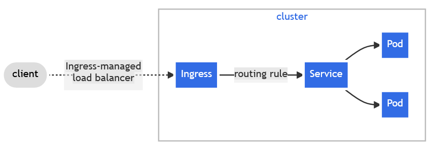

# App 5: Network monitoring with ingress

En este proyecto se implementa el uso de [Ingress](https://kubernetes.io/docs/concepts/services-networking/ingress/) a modo de API para gestionar el acceso desde el exterior al cluster.


Imagen extraída de [Ingress, Kubernetes](https://kubernetes.io/docs/concepts/services-networking/ingress/)

*Nota: Actualmente Kubernetes recomienda el uso de [Gateway](https://gateway-api.sigs.k8s.io/) en lugar de Ingress, ya que este proyecto ya no está en desarrollo*

> <b>Importante:</b>
> 
> Este proyecto toma como base [App-4: network monitoring](App-4.md) y lo modifica para implementar Ingress.

## Requisitos

Además de los necesarios para [App-4: network monitoring](App-4.md), instalaremos un ingresscontroller en el cluster

## Guía

0. Resetear el clúster

Dado que si intentas hacer instalaciones con todos los servicios y despliegues anteriores te dará problemas, te recomiendo que borres todo el clúster y comiences de 0

```
minikube delete && minikube start
```

*Nota: Esto implica que tendrás que volver a hacer build de todas las imágenes*

1. Instalar el controlador

Instalamos el controlador NGINX Ingress controller con el siguiente comando:

```
minikube addons enable ingress
```

2. Modificar los services

Como ahora vamos a utilizar ingress como puerta de entrada al cluster, ya no necesitamos tener configurado el service de dashboard como NodePort, puedes cambiarlo por ClusterIP en el archivo values.yaml. Puedes ver el cambio [aquí](./../projects/App-5/network-monitoring/helm/network-monitoring/charts/dashboard/values.yaml)

3. Crear el recurso ingress

Creamos el recurso ingress.yaml dentro de las templates del umbrella chart (chart padre). Puedes ver el contenido del archivo [aquí](./../projects/App-5/network-monitoring/helm/network-monitoring/templates/ingress.yaml)

4. Añadir los values de ingress

En el archivo values.yaml del umbrella chart (chart padre), incluir los nuevos valores para el ingress. Puedes ver el contenido del archivo [aquí](./../projects/App-5/network-monitoring/helm/network-monitoring/values.yaml)

5. Hacer la instalación del chart

Usamos Helm para hacer la instalación:

```
helm install network-monitoring .
```
6. Hacer tunel para poder emplear el ingress

Para poder conseguir una ip externa que podamos utilizar, necesitamos habilitar el tunel de minikube, lo que le dará una external-ip a nuestro ingress.

```
minikube tunnel
```

7. Modificar los hosts del sistema

Ahora podemos ver la ip externa del ingress e introducirla en el archivo hosts del sistema para que funcione a modo de dns.

Para ver la external IP usamos el siguiente comando:

```
kubectl get svc -n ingress-nginx
```

Ahora configuramos esa dirección ip con el nombre en el archivo hosts

```
# Para abrir el archivo hosts
notepad C:\Windows\System32\drivers\etc\hosts
```

Y guardas la ip y nombre:

<external-ip> network-monitoring.local-demo

8. Acceder a través del navegador